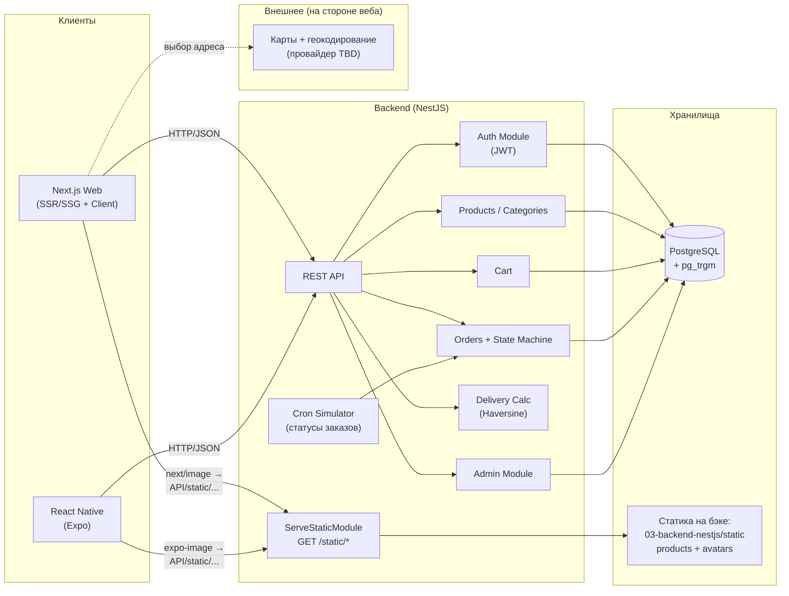

# Архитектура системы

Высокоуровневая карта сервисов и связей.

## Заметки

- **Картинки на бэке — единый источник для веба и мобилки.** Лежат в `03-backend-nestjs/static/` (`products/` и `avatars/`), отдаются через `ServeStaticModule` по `{API}/static/...`. БД хранит только относительные пути.
- **Веб:** `next/image` с доменом бэка в `images.remotePatterns` — кэш и оптимизация Next.js на месте.
- **Мобилка:** `expo-image` с тем же базовым URL, встроенный кэш на устройстве.
- **Никакого дублирования картинок** в коде клиентов — оба слоя ходят за одним URL.
- **Миграция в облако** (Cloudflare R2 / S3 / CDN) — меняется конфигурация бэка или путь монтирования volume; код веба и мобилки не трогается.
- **Загрузка файлов пользователем не поддерживается** — сознательное решение MVP.
- Карты и геокодирование живут на клиенте (веб). Бэкенд хранит только координаты и строку адреса.
- Cron-симулятор продвигает заказы по статусам (см. `order-state-machine.md`).
- Поиск — Postgres ILIKE + расширение `pg_trgm` для нечёткого совпадения.
