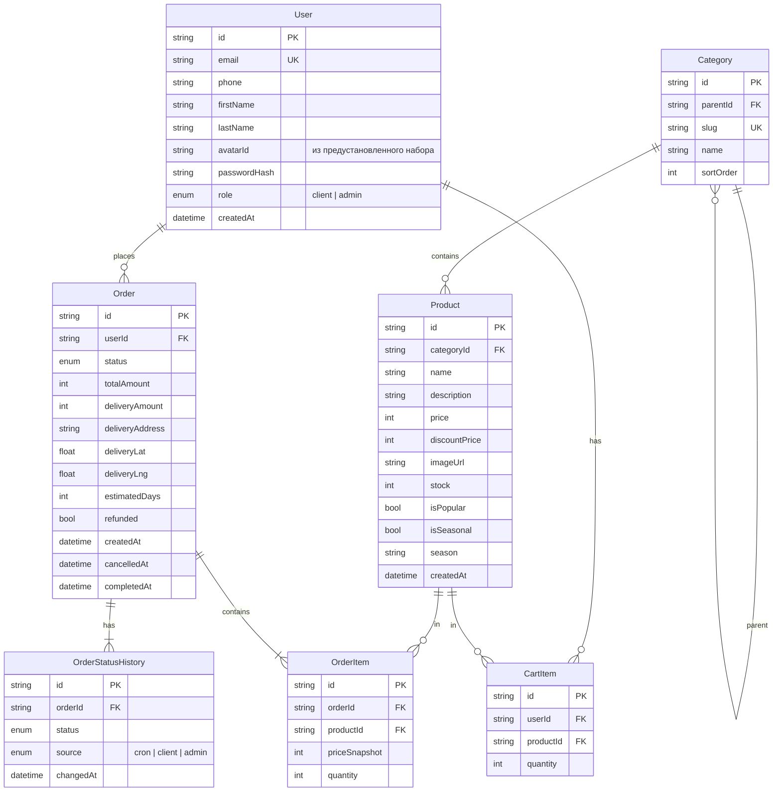

# ER-диаграмма (доменная модель)

Сущности и связи в БД. Источник правды для будущей схемы Prisma.

## Заметки

- **`User.role`** — `client` или `admin`. Курьера нет (см. требования v1).
- **`User.avatarId`** — идентификатор аватара из преднастроенного набора (5–10 вариантов). Сами файлы лежат на бэке (`03-backend-nestjs/static/avatars/`) и отдаются через `{API}/static/avatars/...` обоим клиентам. Пользовательская загрузка файлов не поддерживается.
- **`Category.parentId`** — самосвязь для дерева категорий (топ-категория → подкатегории).
- **`Product.price`** хранится в **копейках** (int), чтобы не было проблем с float.
- **`OrderItem.priceSnapshot`** — цена на момент заказа (на случай если цена товара поменяется).
- **`Order.estimatedDays`** — расчётный срок доставки на момент создания.
- **`OrderStatusHistory.source`** — кто инициировал переход (для аудита и UI таймлайна).
- **`CartItem`** хранится только для авторизованных пользователей. Гостевая корзина — в localStorage на клиенте.
