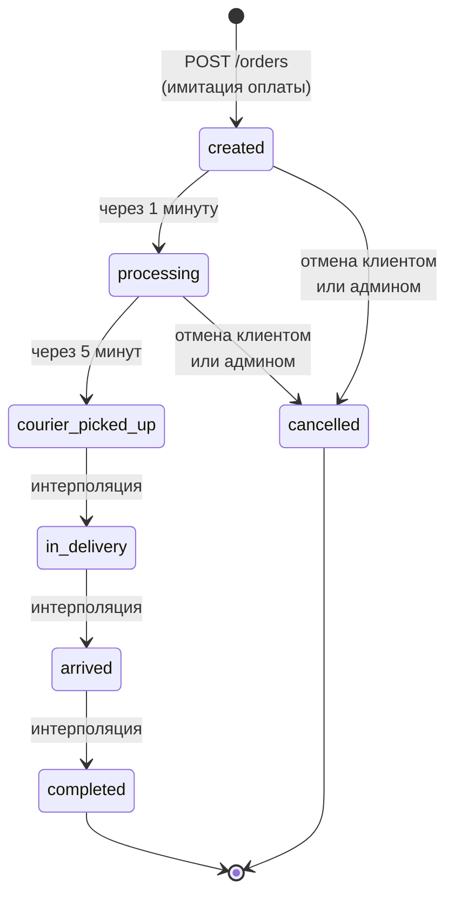

# State machine заказа

Жизненный цикл заказа от создания до завершения. Переходы между статусами автоматические — выполняет cron-симулятор на бэкенде.

## Тайминги переходов

| Из | В | Время |
|----|---|-------|
| `created` | `processing` | 1 минута |
| `processing` | `courier_picked_up` | 5 минут |
| `courier_picked_up` | `in_delivery` | интерполяция |
| `in_delivery` | `arrived` | интерполяция |
| `arrived` | `completed` | интерполяция |

### Интерполяция

Общий расчётный срок доставки (`estimatedDays`) распределяется между **тремя последними переходами** (`courier_picked_up → in_delivery → arrived → completed`). Алгоритм распределения:

- Считаем `totalDeliveryMs = estimatedDays * 24 * 60 * 60 * 1000` минус первые 6 минут (1 + 5) на «принят» и «обработка».
- Делим на 3 примерно равных интервала (или с настраиваемыми долями, например 60% → `in_delivery`, 35% → `arrived`, 5% → `completed`).

Точное распределение — параметр конфигурации, выбираем на этапе реализации.

## Отмена и возврат

- **Отмена возможна** из статусов: `created`, `processing`.
- **Запрещена** из: `courier_picked_up` и далее.
- При отмене:
  - заказ переходит в `cancelled`;
  - флаг `refunded: true` (имитация возврата средств);
  - cron перестаёт его двигать.
- Отменить может **клиент** (свой заказ) или **админ** (любой заказ).

## История переходов

Каждое изменение статуса пишется в `OrderStatusHistory` (orderId, status, changedAt, source: `cron` | `client` | `admin`). На UI таймлайн заказа строится из этой истории.
