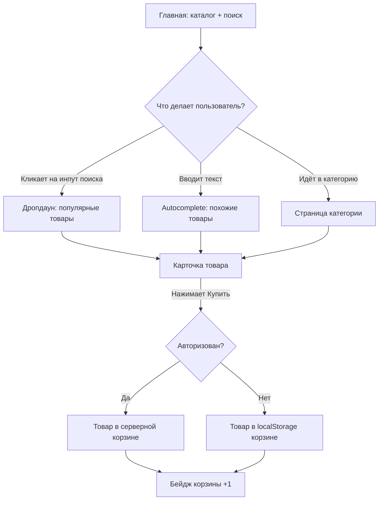
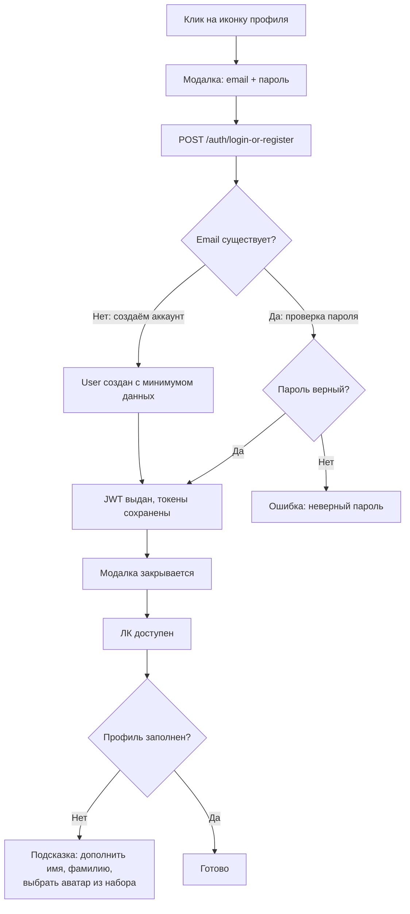
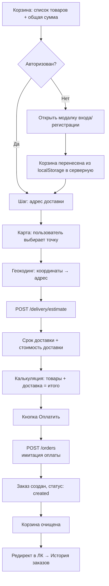
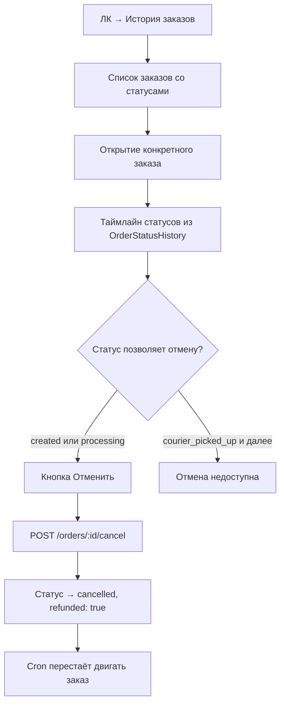
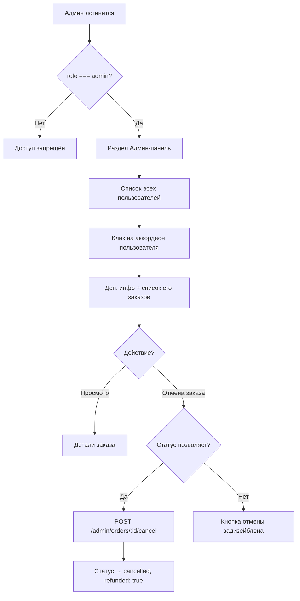
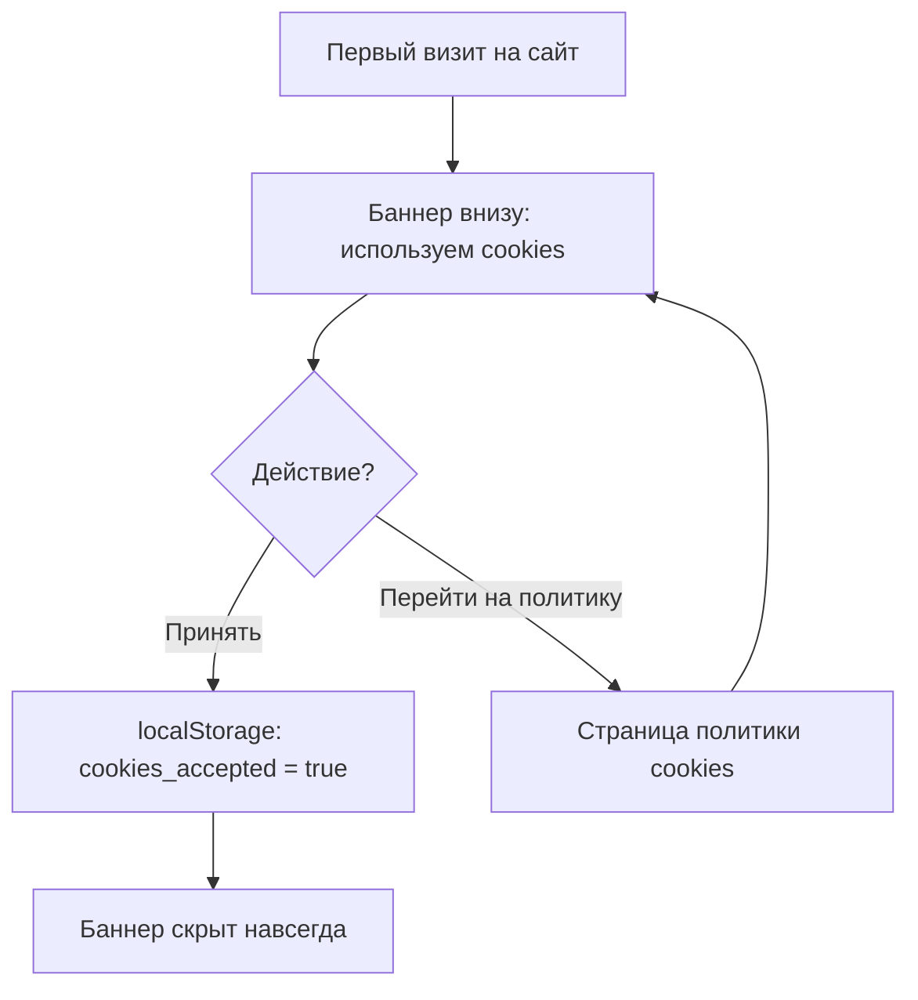

# User flows

Ключевые пользовательские сценарии. Используются как для дизайна экранов, так и для проектирования API.

---

## 1. Поиск и выбор товара (гость или клиент)

---

## 2. Регистрация / вход (единая модалка)

---

## 3. Оформление заказа

---

## 4. Отслеживание и отмена заказа

---

## 5. Админка: пользователи и их заказы

---

## 6. Cookie-баннер

